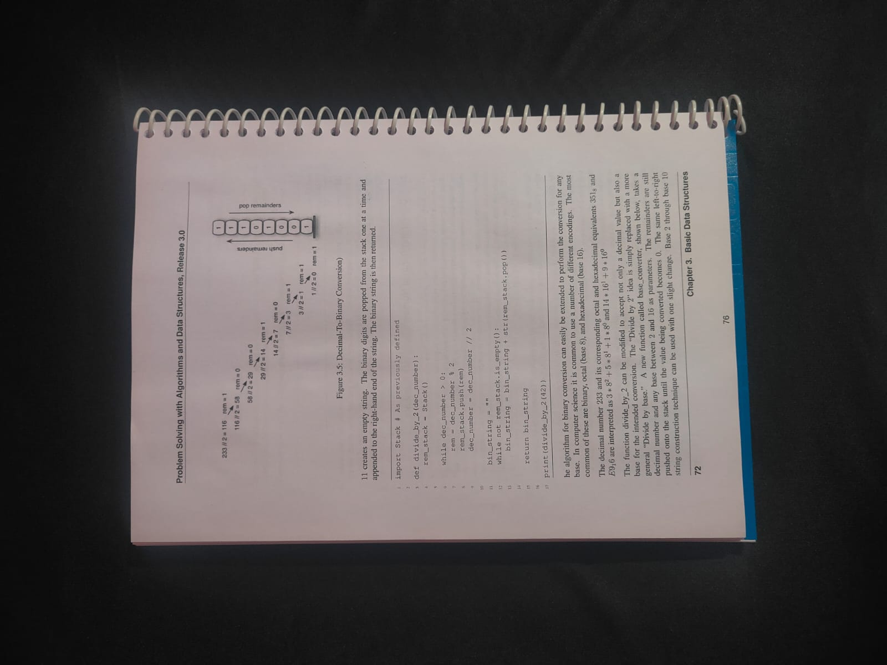

# Document Scanner

A classical computer vision pipeline that detects a document in a photograph,
corrects its perspective, and outputs a clean, print-ready scan.
Built with Python and OpenCV. No ML models, no cloud services.

---

## About This Project

This project was built as the first of three portfolio projects targeting
freelance computer vision work on Upwork.

### Development Transparency

This project was built with AI assistance (Claude by Anthropic) as a
learning and mentorship tool. Here is an honest breakdown of what was
done independently vs. with assistance:

**Done independently:**
- Requirements extraction and assumption documentation
- Pseudocode and pipeline design
- First attempts at every function before receiving feedback
- Debugging and tuning (Canny thresholds, epsilon values, area ratios)
- All Git commits and project management
- Testing on real sample images and interpreting results

**Done with AI guidance (reviewed and typed manually):**
- `transform_perspective()` — the distance calculation and warpPerspective
  setup was explained conceptually and then implemented with guidance
- `order_points()` — the sum/difference logic for corner sorting was
  explained before implementation
- Boilerplate setup for logging, config loading, and .env loading

**Done entirely by AI (copied and adapted):**
- Final `find_document_contour()` — after multiple failed attempts,
  the working version was provided and studied
- Test script structure in `test_pipeline.py`

Every line of code was read, typed manually, and understood before
being committed. No code was blindly copy-pasted without comprehension.

---

## Sample Results

### Input


### Output


---

## How It Works

```
Input Image
↓
Grayscale + Gaussian Blur     (noise reduction)
↓
Canny Edge Detection          (find edges)
↓
Dilation                      (close edge gaps)
↓
findContours + approxPolyDP   (find document boundary)
↓
order_points                  (sort corners TL→TR→BR→BL)
↓
getPerspectiveTransform       (compute correction matrix)
↓
warpPerspective               (apply top-down correction)
↓
Orientation Fix               (rotation + flip correction)
↓
Adaptive Thresholding         (clean scan appearance)
↓
Save Output as PNG
```
---

## Works Best With

- Plain paper documents (A4, notebooks, printed pages)
- Document on a contrasting background (dark table, dark floor)
- Moderate shooting angle (not flat, not extreme)
- Even lighting without harsh shadows
- Document occupying at least 20% of the frame

---

## Known Limitations

- Busy or colorful document covers confuse edge detection
- Tiled or patterned backgrounds can interfere with contour finding
- Severe paper curl or warp is not handled
- Output orientation may occasionally require manual correction
- Does not support batch processing (single image input only)

---

## Setup

### 1. Clone the repo
```bash
git clone https://github.com/your-username/Document-Scanner.git
cd Document-Scanner
```

### 2. Create and activate virtual environment
```bash
python -m venv venv
venv\Scripts\activate        # Windows
source venv/bin/activate     # Mac/Linux
```

### 3. Install dependencies
```bash
pip install -r requirements.txt
```

### 4. Configure paths
Copy `.env.example` to `.env` and fill in your paths:

INPUT_PATH=your/input/folder/
OUTPUT_PATH=your/output/folder/
LOG_PATH=your/logs/folder/

---

## Usage

```bash
python src/main.py --image document.jpg
```

Output will be saved to your `OUTPUT_PATH` folder as:
processed_document.png

---

## Configuration

All tunable parameters are in `config/config.yaml`:

```yaml
gaussian:
  kernel_size: 5        # blur strength before edge detection

canny:
  threshold1: 15        # lower edge threshold
  threshold2: 100       # upper edge threshold

contour:
  min_area_ratio: 0.05  # minimum document size as % of image

output:
  image_format: ".png"
  prefix: "processed_"
```

Adjust these values if the pipeline struggles with your specific images.

---

## Project Structure

Document-Scanner/
├── src/
│   ├── main.py          ← entry point, pipeline orchestration
│   └── pipeline.py      ← all CV functions
├── config/
│   └── config.yaml      ← tunable parameters
├── tests/
│   └── test_pipeline.py ← basic pipeline tests
├── samples/             ← sample input images
├── output/              ← processed output images
├── logs/                ← log files
├── .env.example         ← path configuration template
├── requirements.txt
└── README.md

---

## Tech Stack

- Python 3.x
- OpenCV (`opencv-python`)
- NumPy
- PyYAML
- python-dotenv

---

## Freelance Context

This project was scoped and built following a simulated client engagement
workflow:

1. Read and understood client brief
2. Extracted functional and non-functional requirements
3. Documented assumptions explicitly
4. Performed feasibility check against OpenCV capabilities
5. Wrote pseudocode before any implementation
6. Scaffolded project structure before writing CV code
7. Built iteratively, one function at a time
8. Tested on real sample images
9. Documented limitations honestly

